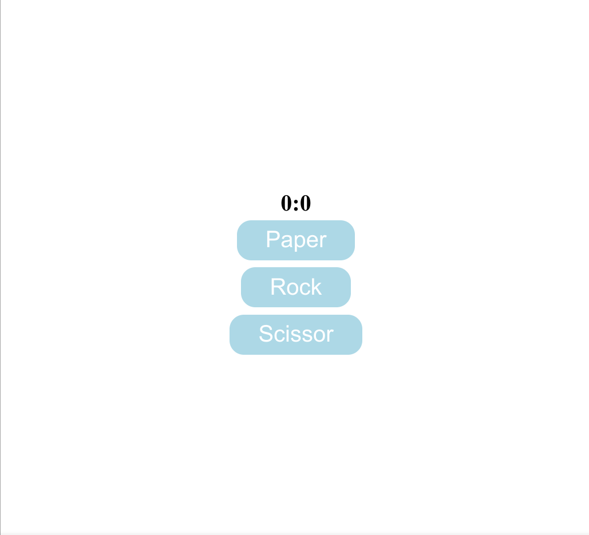

<h1>About Website</h1>
<p>Paper, Rock And Scissor</p>

<ul>
<li> Html</li>
<li> Css</li>
<li> Javascript </li>
</ul>
<h1> How to use </h1>
<ul>
<li>How to clone</li>

```bash
git clone git@github.com:joelwillSeek/Rock-Paper-Scissors-Oden.git
```

<li>How to run it</li>
<p>Open the index.html to browser</p>
</ul>
<h1> Acknowledgments </h1>
<a href="https://icons8.com/icons/set/javascript">Icons 8</a>